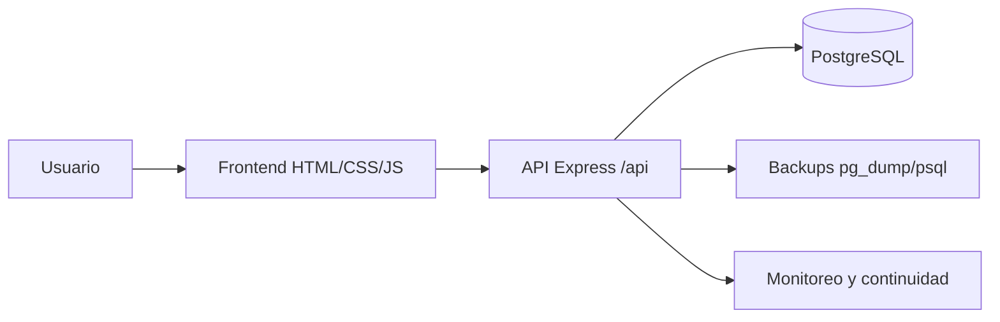

# SIGEH

SIGEH es un sistema integral de gestion hospitalaria con backend Node.js/Express, PostgreSQL como fuente de verdad, frontend web liviano y procedimientos almacenados para la logica critica.

## Arquitectura



- Frontend: [frontend/index.html](frontend/index.html), [frontend/pages/](frontend/pages), [frontend/js/](frontend/js), [frontend/styles.css](frontend/styles.css)
- Backend: [src/server.js](src/server.js), [src/controllers/](src/controllers), [src/routes/](src/routes), [src/middleware/](src/middleware)
- Base de datos: [database.sql](database.sql)
- Documentacion por bloques: [docs/](docs)
- Mapa de inconsistencias: [docs/MAPA_INCONSISTENCIAS_DETECTADAS.md](docs/MAPA_INCONSISTENCIAS_DETECTADAS.md)
- Cierre academico pendiente: [docs/BLOQUE7_CIERRE_PENDIENTES_ACADEMICOS.md](docs/BLOQUE7_CIERRE_PENDIENTES_ACADEMICOS.md)
- Scripts operativos: [scripts/](scripts)

## Tecnologias

- Node.js + Express
- PostgreSQL
- JWT
- bcrypt
- helmet
- express-rate-limit
- pg
- PowerShell para scripts operativos en Windows

## Requisitos

- Node.js 18 o superior
- PostgreSQL operativo con la base `sigeh_db`
- `pg_dump`, `psql`, `createdb` y `dropdb` disponibles en PATH
- PowerShell en Windows

## Instalacion

1. Instalar dependencias:

```powershell
npm install
```

2. Crear la base de datos cargando el script principal `database.sql` en PostgreSQL.

3. Ajustar el archivo `.env` con credenciales locales.

4. Levantar el backend:

```powershell
npm run dev
```

## Configuracion `.env`

Variables principales:

- `PORT`: puerto del backend
- `DATABASE_URL`: cadena de conexion para scripts puntuales
- `PGHOST`, `PGPORT`, `PGUSER`, `PGPASSWORD`, `PGDATABASE`: conexion principal del backend
- `JWT_SECRET`: secreto local para firmar tokens
- `JWT_EXPIRES_IN`: expiracion del JWT
- `BACKUP_DIR`: carpeta de respaldos
- `BACKUP_USERNAME`: usuario para registrar respaldos
- `STANDBY_DB`: nombre de la base standby
- `LOGIN_MAX_ATTEMPTS`: maximo de intentos fallidos para bloqueo temporal
- `LOGIN_LOCKOUT_MINUTES`: minutos de bloqueo temporal
- `API_RATE_LIMIT`: limite global de solicitudes por ventana
- `AUTH_RATE_LIMIT`: limite de intentos contra `/api/auth/login`

Usa [.env.example](.env.example) como referencia.

## Ejecucion

### Backend

```powershell
npm run dev
```

### Frontend

Abrir [frontend/index.html](frontend/index.html) en el navegador o servirlo como archivo local. El frontend usa `http://localhost:3000/api` cuando corre desde `file://`.

## Autenticacion

- Login: `POST /api/auth/login`
- JWT con roles:
  - `ADMIN`
  - `MEDICO`
  - `USUARIO_GENERAL`
- El frontend guarda la sesion en `sessionStorage`.
- El backend aplica bloqueo temporal tras intentos fallidos.

## Endpoints principales

### Salud

- `GET /api/health`

### Auth

- `POST /api/auth/login`

### Usuarios

- `GET /api/usuarios`
- `GET /api/usuarios/:id`
- `POST /api/usuarios`
- `PUT /api/usuarios/:id`
- `DELETE /api/usuarios/:id`

### Auditoria

- `GET /api/auditoria/accesos`
- `GET /api/auditoria/cambios`
- `GET /api/auditoria/respaldos`
- `POST /api/auditoria/respaldos`

### Reportes

- `GET /api/reportes/ocupacion-camas`
- `GET /api/reportes/historial-consultas`
- `GET /api/reportes/inventario-farmacia`
- `GET /api/reportes/facturacion-mensual`

### Infraestructura

- `GET /api/infra/monitor/overview`
- `GET /api/infra/replication/status`

## Procedures y vistas importantes

### Procedures

- `registrar_nueva_consulta`
- `procesar_alta_hospitalaria`
- `surtir_receta_farmacia`
- `generar_factura_consulta`
- `registrar_pago_factura`

### Vistas

- `vw_expedientes_completos`
- `vw_ocupacion_camas`
- `vw_historial_consultas`
- `vw_inventario_farmacia`
- `vw_facturacion_mensual`

## Scripts disponibles

- `npm run backup:db`
- `npm run restore:db`
- `npm run monitor:db`
- `npm run alerts:check`

## Evidencia para Capitulo 8 en Word

Estos archivos no son scripts de la app; son guias SQL para ejecutar en pgAdmin y documentar la Fase 3:

- `scripts/optimization-explain.sql`: genera planes `EXPLAIN ANALYZE` antes/despues para consultas criticas.
- `scripts/move-critical-table-tablespace.sql`: mueve la tabla critica `consultas` a otro tablespace y valida que siga consultable.

## Respaldos

- El flujo real usa `pg_dump` y `psql`.
- Los archivos se guardan en `backups/`.
- El historial queda registrado en `respaldos_realizados`.

## Seguridad

- `helmet` activo
- CORS restringido a desarrollo local
- rate limiting global
- rate limiting de login
- bloqueo temporal por intentos fallidos
- validacion de entradas criticas
- JWT en `sessionStorage`
- cuenta de aplicacion limitada `sigeh_app`

## Estructura de carpetas

```text
SIGEH/
  database.sql
  frontend/
    pages/
    js/
  src/
    config/
    controllers/
    middleware/
    routes/
    services/
  scripts/
  docs/
  migrations/
  backups/
```

## Evidencia y pruebas

Consulta:

- [docs/BLOQUE3_RESPALDOS_RECUPERACION.md](docs/BLOQUE3_RESPALDOS_RECUPERACION.md)
- [docs/BLOQUE4_REPLICACION_MONITOREO.md](docs/BLOQUE4_REPLICACION_MONITOREO.md)
- [docs/BLOQUE5_SEGURIDAD_OPERATIVA.md](docs/BLOQUE5_SEGURIDAD_OPERATIVA.md)
- [docs/BLOQUE6_ENTREGA_FINAL.md](docs/BLOQUE6_ENTREGA_FINAL.md)

## Troubleshooting

- Si `npm run dev` falla, revisar `PGHOST`, `PGPORT`, `PGUSER`, `PGPASSWORD`, `PGDATABASE` y que PostgreSQL esté activo.
- Si el frontend muestra 401, verificar el token y que no haya expirado.
- Si los scripts de backup/restore fallan, confirmar que `pg_dump`, `psql`, `createdb` y `dropdb` estén en PATH.
- Si el login devuelve 423, la cuenta quedó bloqueada temporalmente por intentos fallidos.
- Si `GET /api/infra/*` devuelve 403, el JWT no pertenece a `ADMIN`.
